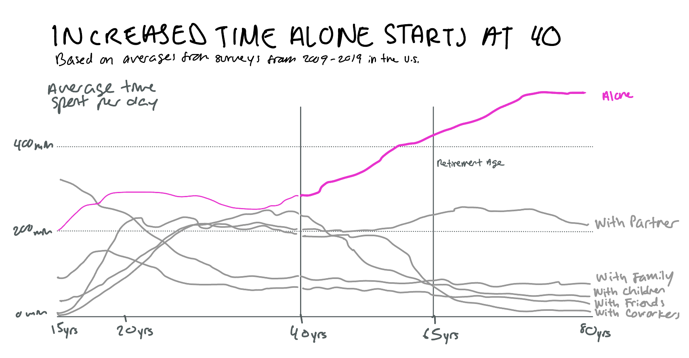
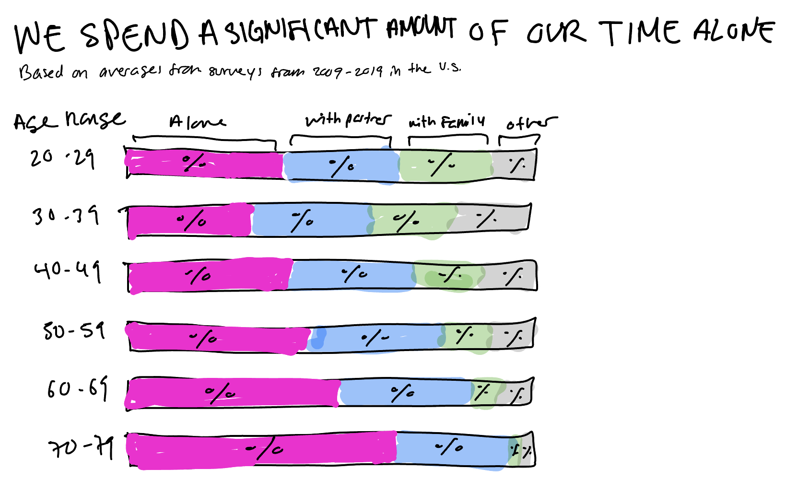
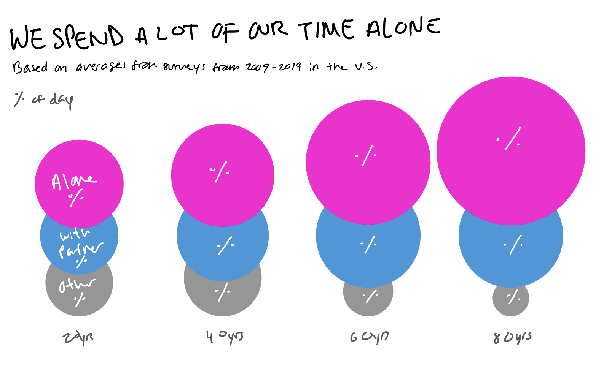

| [home page](https://aaifeng.github.io/portfolio/) | [visualizing debt](visualizing-government-debt) | [critique by design](critique-by-design) | [final project I](final-project-part-one) | [final project II](final-project-part-two) | [final project III](final-project-part-three) |

# Critique by Design

## Choosing a visualization

I chose to critique and redesign the visualization from Our World in Data about Americans' average time spent per day alone, with family, with a partner, with friends, with coworkers, and/or with children.

### MakeoverMonday Visualization: Who do we spend time with across our ifetime?
Original visualization from Our World in Data: [https://ourworldindata.org/time-use#who-do-we-spend-time-with-across-our-lifetime](https://ourworldindata.org/time-use#who-do-we-spend-time-with-across-our-lifetime)

<iframe src="https://ourworldindata.org/grapher/time-spent-with-relationships-by-age-us?stackMode=absolute%C2%AEion" loading="lazy" style="width: 100%; height: 600px; border: 0px none;"></iframe>

Ortiz-Ospina, Esteban, Charlie Giattino, and Max Roser. “Time Use.” Our World in Data, November 29, 2023. [https://ourworldindata.org/time-use#how-are-working-hours-measured-and-what-can-we-learn-from-the-data.](https://ourworldindata.org/time-use#how-are-working-hours-measured-and-what-can-we-learn-from-the-data)

My overall observations are that the original data visualization is effective and informative. While it is not necessarily telling a story, it does have all the elements necessary to do so and it is already relatively easy to understand without the viewer spending too much time on it. The simplicity of the line graph with just six categories significantly helps with ease of comprehension. The interactive element with the mouse-over statistics also helps with comparing the categories against each other at specific points in time. I think the graph works well enough as is. However, I did not fully read the subtitle and note until well into my visual analysis, and that information would have been helpful in my initial understanding of the visualization. I would try to reduce the wordiness of that information, as well as remove the callout lines for the category names and reduce the number of tick marks on the y- and x-axis to reduce overall clutter.

### Stephen Few Critique Method

The Stephen Few method involves a sliding scale for seven categories:

- Usefulness
- Completeness
- Perceptibility
- Truthfulness
- Intuitiveness
- Aesthetics
- Engagement

I think this method puts more emphasis on the intended audience and the perception of the data's message, as opposed to the Good Charts method, which is centered around the viewer's gut reaction to aesthetics and tailored towards progressing the sketching and prototyping process. I think the Good Charts method is more helpful as a starting point for the creation of a sketch, and the added Few method can provide more insights on how the intended audience might read and interpret the graph. In this case, I appreciated using the Few method because I needed to think more about the context of the graph rather than just the graph as a stand alone.

For both perceptibility and intuitiveness, I mentioned in my initial observations that the visualization type, a line graph with limited categories, is one that is generally easy to comprehend. I believe that the visualization is complete with all necessary elements to make the data understandable: each axis is labeled, the categories are labeled, and the title and subtitle contain information about the location and time span of data collected. The note at the bottom also compensates for the lack of a complete day in minutes represented on the y-axis. Hand-in-hand with truthfulness, I think the completeness of the graph compliments how truthful the data is in this case. I was left wondering, however, how big the sample size was for the surveys, which I could not find on the graph or in the article. In terms of aesthetics, it is not a particularly beautiful data visualization, but I do think that it is straightforward and relatively easy to interpret. The line graph puts the greatest emphasis on viewing the data change over time (age), however I think what makes it interesting to look at is its engagement factor. Minutes spent per day is something that everyone can relate to and value, if not for themselves then for someone they know, like aging parents. The diverging lines towards the right side of the graph (older ages) also naturally attracts the viewer's eye.

I was not able to clearly identify an intended audience, however using context from the article and the time of publishing, I can make an educated guess about the audience. This data is part of an article that was published in November of 2020, so whatever audience is reading the article is one that has been affected by COVID-19 and is hyperconscious of their time. Given that the article is published on a data-focused website, my guess is that this data would then be repackaged by reporters and news outlets to comment on behavior patterns pre-COVID-19 as compared to emerging and potential patterns in these unprecedented times. To that end, I think the visualization is effective for reaching the audience of news outlets because it is robust and complete enough for news outlets to each glean different headlines from it. It seems to have a lot of different potential stories that can be told through visualization. For the audience that will see this data from a news outlet source, I think the data would be useful and most relevant to people approaching age 40, which is where the lines start to diverge, or people who are over the age of 40. For people approaching 40, this data provides relevant information for how they might divide their time in years to come and could be an incentive for them to take action if they do not like the average trajectory. For audiences over 40, this could also serve as an incentive for them to reevaluate whether their personal patterns mimick the average, and whether that is something that they want to consider changing.

As for changes to the visualization, I would consider reducing the data into age brackets (i.e., 15-29, 30-44, etc.) and use a bar graph to better visualize which categories dominate which age ranges. I am really intrigued by the category exchange at age 40, so I would definitely want to highlight that point, potentially by having time spent alone in a bright color and muting the other categories in colors with less opacity or in gray, and with some sort of callout at age 40.

## Sketching & Prototyping

### Sketch 1

As mentioned, I was immediately intrigued and surprised by the increased time spent alone starting at 40 years of age, which felt rather young to me. I would have thought that increased time alone would spike at the U.S. retirement age, which is 65. This thought process led to sketch 1 below. I wanted to highlight the line for time spent alone, and I wanted to make a note of the divergence starting at 40 as well as the retirement age at 65. I also modified the title to guide viewers towards what I was interested in showing more prominently. I did keep the x- and y-axis relatively the same, with the exception of reducing the intervals of the tick marks for similar understanding with a cleaner aesthetic. The other categories were muted in gray since I thought that their context was interesting but not the focal point, and the decision to reduce the line weight of time spent alone before the 40-year mark was once again to emphasize the change that happens at 40. I was on the fence about changing the line weight, so I decided to keep it in so that I could get feedback on it.

### Sketch 2

After finishing sketch 1, I realized that I saw the time spent with varying people as distinct categories and thought that a stacked bar chart might be interesting. What is different in sketch 2 from sketch 1 is that I am no longer focused on a trend starting at age 40, but rather just an overall dominance of average time spent alone per day throughout a lifetime. With the focus on time spent alone, I felt comfortable moving forward with a stacked bar chart if time spent alone was the foundation of the bar, which is the area that is easiest to read and compare. Again, I was less interested in the other categories so I was not as concerned that they would not be as easily comparable. I also grouped some of the categories since the focus is on time spent alone. I refrained from making these completely binary categories (i.e., time spent alone vs time spent in general company) because I think having some of the categories provides important context for viewers to understand what exactly is being compared. "Time spent in general company" or "with others", in my opinion, requires a bit more processing than I would like for this graph.

### Sketch 3

In one last effort to think out of the box, I thought size of shape, akin to a tree map, might be an interesting way to display the amount of time spent alone as compared to the other categories. In this case I took four ages that span the data to represent how the categories shift over time. While I like the visual comparison of the circles, I felt that this sketch was not as easy to grasp as the previous sketch.

## Testing through Interviews
I debated between sketch 1 and sketch 2, ultimately deciding to show both sketches to the people I would interview. I asked two people the five questions below. I presented them first with sketch 1 and then asked their thoughts on sketch 2, including if they had a preference between the two sketches.

- Can you tell me what you think this is?
- Can you describe to me what this is telling you?
- Is there anything you find surprising or confusing?
- Who do you think is the intended audience for this?
- Is there anything you would change or do differently?

### Interviewee #1: adult, early 60s

This person's interpretation of sketch 1 was that the data represented people (as in people were a measure, and that it was likely people who work). They were able to follow the x-axis clearly and thought the drop-off of the other categories and spike in time spent alone at 40 was evident. Because of the emphasis on time spent alone, they found the breakdown of the other categories distracting and thought that those categories could be grouped together as one category. The total time in a day of the respondents was not clear, and they thought the y-axis as measured in minutes was difficult to quantify and relate to. They recommended changing the y-axis to hours or a percentage. They also recommended reducing the curvature of the lines and keeping the line weight of time spent alone consistent. For intended audience, they thought the visualization was geared towards people who are older to encourage them to be more social, as well as people who are younger, to encourage them to maintain their time spent with the people in the various categories.

When I showed this person sketch 2 they said that while sketch 1 was more visually dramatic, sketch 2 seemed to present the data more clearly and in a way that made more sense with how they would visualize the data.

### Interviewee #2: adult, late 20s

This person interpreted sketch 1 as data representing people's relationship status. As we worked through the questions and moved on to sketch 2, their understanding changed to that of the average time spent per day. Like Interviewee #1, this person also felt like the graph was clearly communicating that time spent alone increases at a constant rate after age 40. They found the category labels confusing - particularly when they thought that the data represented relationship status. They were focused on differentiating the lines in gray towards the bottom of the chart around age 80, and would have preferred for those categories to be shown in different colors to better distinguish them. They thought the intended audience was rather general as the data seemed widely relatable, but also thought the data could be more relevant to people who are older and people who are younger as a reflection of actual time spent and as an expectation of what is to come. One comment I found interesting is that they thought the title of the graph was leading and would have preferred a more neutral title and neutral presentation of the data for them to make their own observations.

I mentioned that this person's understanding changed when we moved to sketch 2. They commented that sketch 2 was a clearer representation of the data and a better way to show time spent within a day. They felt that the percentages in sketch 2 were more valuable and understandable than the minutes on the y-axis of sketch 1. I especially appreciated this interviewee's positive feedback on the color palette given that they are affected by color blindness.

### Key Takeaways

While each interviewee had slightly different interpretations, I saw a pattern in some of the things that they brought up. Sketch 2 seemed to resonate more with them than sketch 1, both in aesthetics and in understanding the variables being measured and compared. I was also surprised that both of them were focused on the other categories, despite titles suggesting otherwise, when my main focus was on time spent alone.

## Redesign

The critique and testing process helped me identify what worked well, which was trend lines, and what was unclear, which was what the data being measured. After hearing the feedback from the people I interviewed, I ended up changing directions and moving forward with the concept for sketch 2. I agreed with the feedback that the categories were more discernable in sktech 2 and that the layout of the visualization helped clarify that the variable being measured is percent of time in a day. I did follow the Watch Me Viz tutorial out of curiosity, however they made few changes to the visualization as they already liked its original form.

The redesign I created below tells a slightly more narrative story than its original, which I and both interviewees thought might be relevant for younger and older audiences for different reasons. The new title addresses both potential audience without leaning too subjective. I am still a bit worried that the graph could be interpreted as x% of a certain age range spends time alone, instead of an age range on average spends x% of their day alone. I considered modifying the title for clarity, but I was worried about the title being too wordy.

I like that this redesigned visualization uses Tableau's highlight feature to select time spent alone as a home base, however the interactiveness of the visualization allows viewers to select a different category and view the data from a different angle if intrigued and desired.

<noscript></noscript><object class='tableauViz'  style='display:none;'><param name='host_url' value='https%3A%2F%2Fpublic.tableau.com%2F' /> <param name='embed_code_version' value='3' /> <param name='site_root' value='' /><param name='name' value='TimeSpentbyAge&#47;Sheet1' /><param name='tabs' value='no' /><param name='toolbar' value='yes' /><param name='static_image' value='https:&#47;&#47;public.tableau.com&#47;static&#47;images&#47;Ti&#47;TimeSpentbyAge&#47;Sheet1&#47;1.png' /> <param name='animate_transition' value='yes' /><param name='display_static_image' value='yes' /><param name='display_spinner' value='yes' /><param name='display_overlay' value='yes' /><param name='display_count' value='yes' /><param name='language' value='en-US' /><param name='filter' value='publish=yes' /></object>
                

Ortiz-Ospina, Esteban, Charlie Giattino, and Max Roser. “Time Use.” Our World in Data, November 29, 2023. [https://ourworldindata.org/time-use#how-are-working-hours-measured-and-what-can-we-learn-from-the-data.](https://ourworldindata.org/time-use#how-are-working-hours-measured-and-what-can-we-learn-from-the-data)

<noscript></noscript><object class='tableauViz'  style='display:none;'><param name='host_url' value='https%3A%2F%2Fpublic.tableau.com%2F' /> <param name='embed_code_version' value='3' /> <param name='site_root' value='' /><param name='name' value='TimeSpentbyAge&#47;Sheet1' /><param name='tabs' value='no' /><param name='toolbar' value='yes' /><param name='static_image' value='https:&#47;&#47;public.tableau.com&#47;static&#47;images&#47;Ti&#47;TimeSpentbyAge&#47;Sheet1&#47;1.png' /> <param name='animate_transition' value='yes' /><param name='display_static_image' value='yes' /><param name='display_spinner' value='yes' /><param name='display_overlay' value='yes' /><param name='display_count' value='yes' /><param name='language' value='en-US' /><param name='filter' value='publish=yes' /></object>
                

