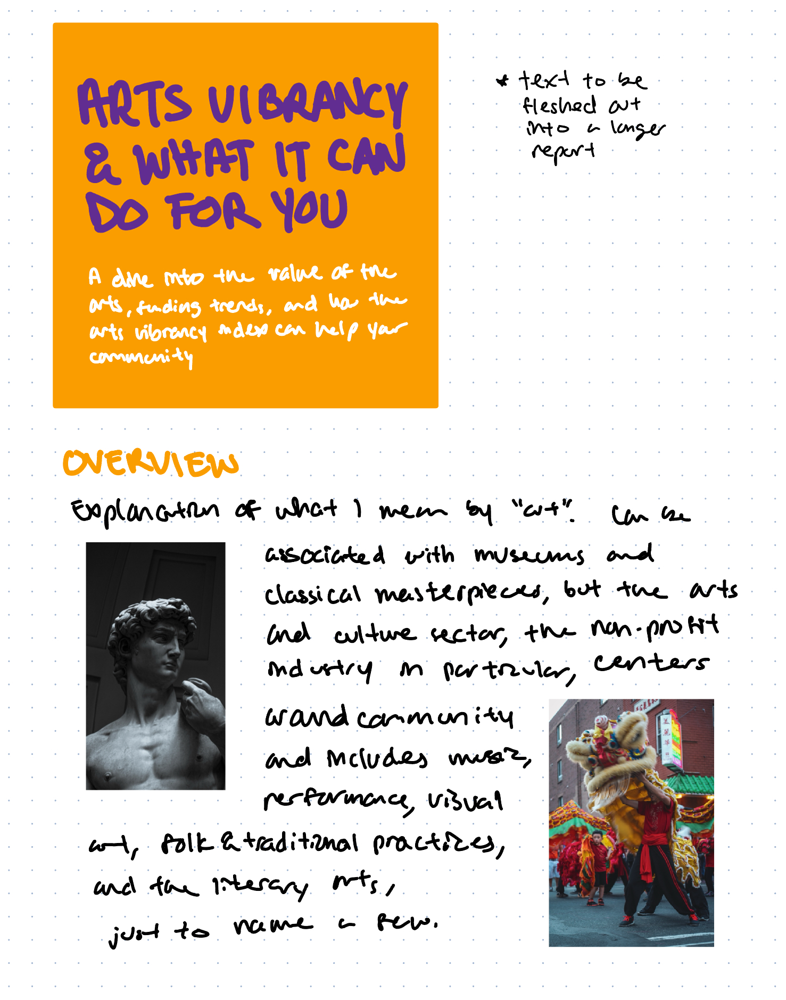
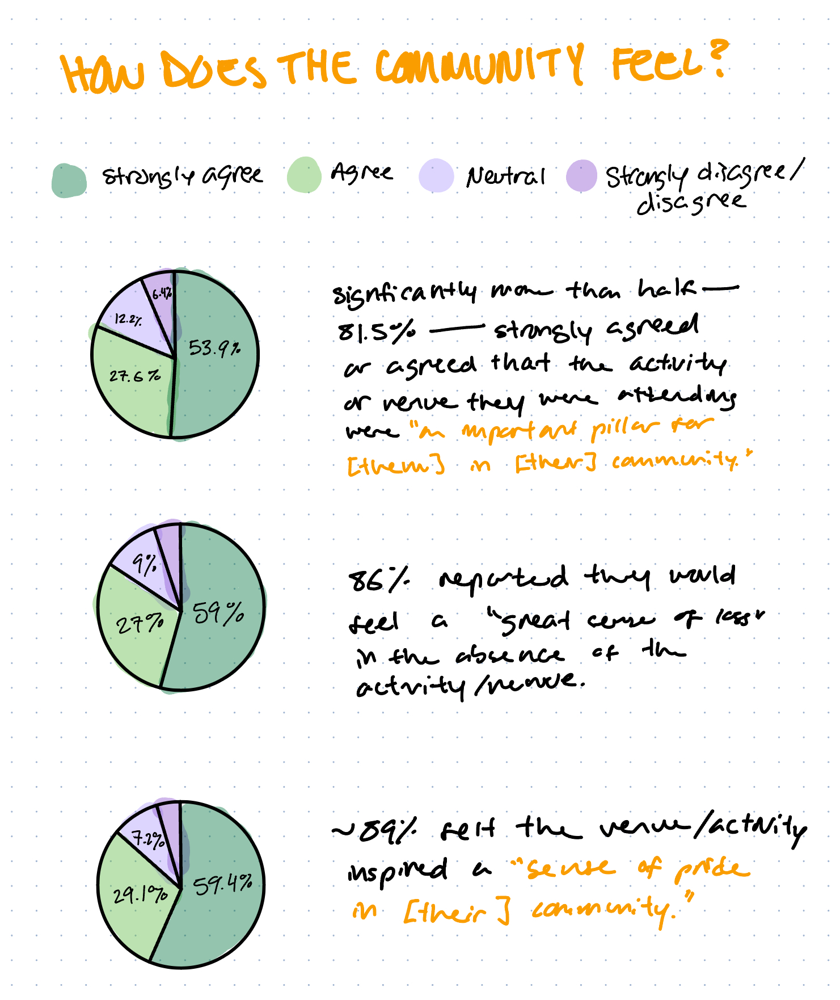
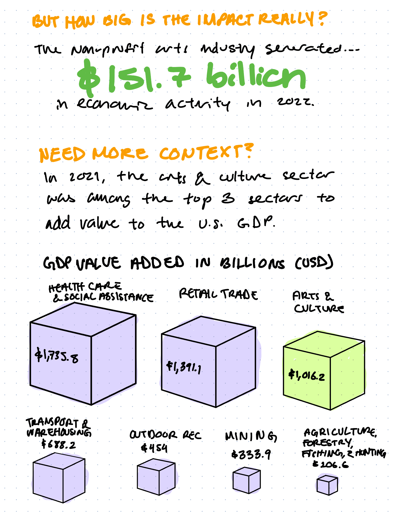
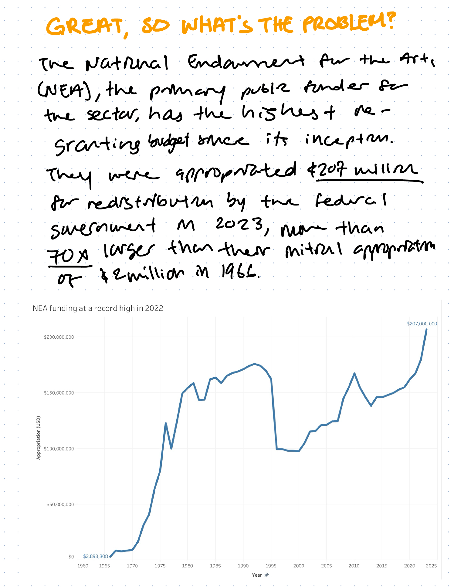
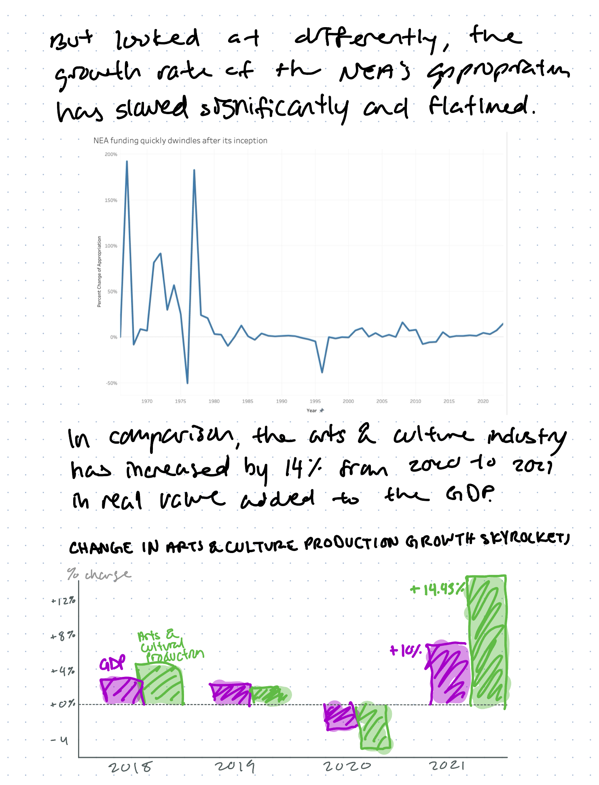
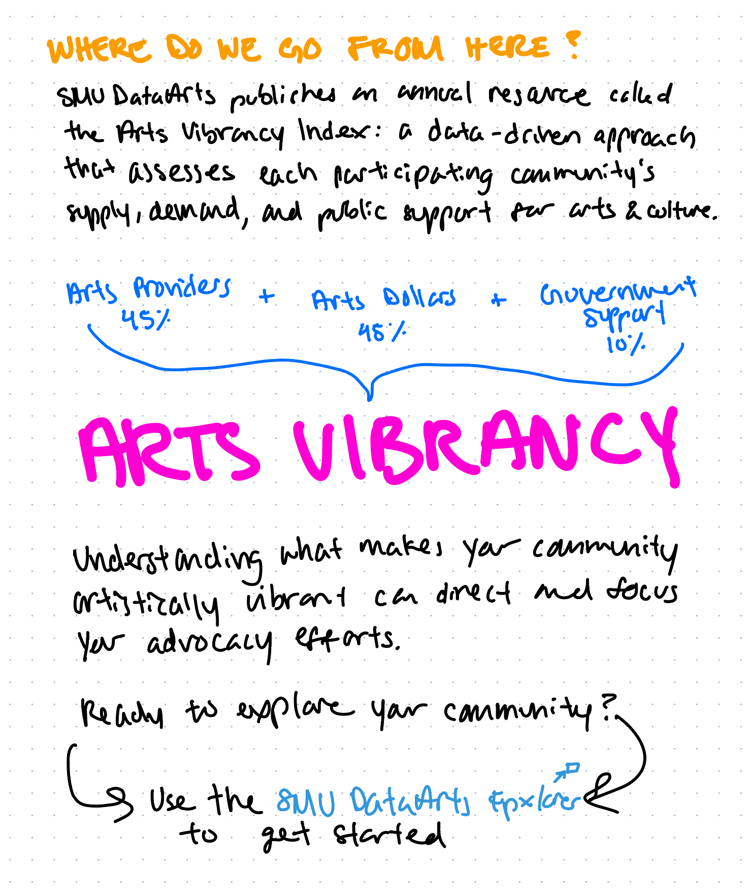

| [home page](https://aaifeng.github.io/portfolio/) | [visualizing debt](visualizing-government-debt) | [critique by design](critique-by-design) | [final project I](final-project-part-one) | [final project II](final-project-part-two) | [final project III](final-project-part-three) |

# Wireframes & Storyboards

The more I thought about my outline in Part I, the more I realized that the story I'd like to tell is slightly different. As a refresher, here is my initial story outline:
- **Setup:** The arts and culture sector is an important part of of our economy and overall daily lives.
- **Conflict:** It’s unclear why some communities have thriving arts and what can be done to uplift the arts in your own community.
- **Resolution:** Understanding the artistic vibrancy of your own community will help you know where to invest and what to advocate for.

I think a more compelling story would go as follows:
- **Setup:** (unchanged) The arts and culture sector is an important part of of our economy and overall daily lives.
- **Conflict:** Funding for the arts has been unstable and increasing at lower rate than the sector's growth rate.
- **Resolution:** As part of the solution to increase funding in the arts, the Arts Vibrancy Index can be a useful tool to understanding your local arts community and identifing where to invest and what to advocate for.

I think I have a lot more data and narrative for this setup and conflict, and I think the resolution/call to action is a bit clearer. As interesting as I find the SMU DataArts data, I was having trouble converting it to a visualization because I don't have access to the full dataset, of which the rankings depend on.

I've also added new sources with fuller datasets:
- The Arts and Cultural Production Satellite Account released by the Bureau of Economic Analysis (BEA): [https://www.bea.gov/data/special-topics/arts-and-culture](https://www.bea.gov/data/special-topics/arts-and-culture)
- National Endowment for the Arts Appropriations History: [https://www.arts.gov/about/appropriations-history](https://www.arts.gov/about/appropriations-history)
- SMU DataArts Interactive Map: [https://dataarts.smu.edu/ArtsVibrancyMap/](https://dataarts.smu.edu/ArtsVibrancyMap/)

The SMU DataArts Map is what I want to link to for my call to action.

It was easier for me to plan the report as a sketched outline, which I have included below. Having an idea of the Shorthand layout I would like to use was helpful in visualizing and sketching the flow of the report.

# User research 

## Target audience

Given the setup that establishes the importance of the arts and culture sector, my target audience would not be people within the sector because that information is redundant. I do think that people just on the margins of the sector, however, could find this data useful. For example, local policy makers who are looking to connect with their community through strategic investments, or the general public who may be interested in increasing the arts activity of their community. As an indirect audience, arts organizations could even use the data and findings as part of their advocacy messages to people in and outside of their community. Because my main intended audience is outside the sector, I will do my best to avoid industry-jargon and to explain concepts that may feel self-explanatory to an insider. For example, the informal feedback sessions during class made me realize that I have to explain what the arts & culture sector is and what arts disciplines are included.

## Interview script

My main goals with the interviews is to determine relevance to the reader, whether the story and graphs are easy to comprehend, and whether the resolution/call to action makes sense.

| Goal | Questions to Ask |
|------|------------------|
|    Narrative flow and comprehension   |       Did this narrative make sense to you? Was there anything that confused you?           |
|  Translation of intended audience    |         Who do you think is the intended audience for this? How do you see this data being used?         |
|  Relevance to audience    |       Did you feel compelled to learn more about this topic?           |
|   Clarity of resolution/call to action   |       What do you think the call to action is?           |
|   Comprehension of visualizations   |         Are the graphs easy to understand?         |
|   Value to audience   |        Did you learn anything new? If so, what?          |
|  Catching anything else that might slip through    |        What questions do you still have?          |

## Interview findings

I tried to include people both in and out of the sector to see if their understanding of the data and findings is different. All three interviewees received a PDF of the screenshots above with the list of questions. For Interview #1, I was able to speak to them on the phone, which was very helpful. Interviews #2 and #3 were conducted through email.

| Questions               | Interview 1 (adult, early 60s, within sector) | Interview 2 (adult, late 20s, outside of sector) | Interview 3 (adult, late 20s, outside of sector) |
|-------------------------|--------------------------------|-------------|-------------|
| Did this narrative make sense to you? Was there anything that confused you? | A (fuller) definition of arts vibrancy at the beginning in addition to what you have at the end would have been helpful. A little more context about the arts vibrancy categories would be great, just for some more context. The rest of the sections (in their order) make sense to me, but rewording the titles will give the reader a better sense of what they're getting into. For example, instead of "how does the community feel?" you might say "how do people feel about the arts in their community?" This would help identify whether the survey questions are about the arts in general or about arts vibrancy. Also include the word "economic" in the next section title. Spelling out the GDP acronym at least once and a short explanation of GDP would have been appreciated.            |       The narrative did make sense to me! I liked the overview and community input to provide context at the start. I didn’t get the connection to arts vibrancy until the figure on the last page, but then it was really clear to me – maybe that could be mentioned sooner?      |        Yeah, it makes sense. People value arts and culture, as evidenced by the polls on page 2 and it being the 3rd largest sector adding to GDP. However, the growth rate in NEA funding has flatlined.     |
| Who do you think is the intended audience for this? How do you see this data being used?                  |         This seems most targeted for council members or politically-oriented people who have an idea of the country's/their community's economic situation. More plainly put: for decision-makers. This might not be as useful within the sector, say for funders, but could maybe be used for their advocacy or to communicate the transparency/impact of their funding (where-is-the-money-going reports).                       |      This was very funding driven, and I could see this being shown to someone in charge of allocating funds, like a granting organization. It seemed as though it was prompting someone from a granting organization to go to the resource mentioned (SMU Data Arts Explorer) to evaluate how they can advocate for more government funding that they can distribute to their community.       |      The intended audience is generally just regular people of communities. This data is trying to show the importance of arts and culture, and the disproportionately dispersed funding. It is a call for them to advocate for increased arts and culture funding to their local leaders.       |
| Did you feel compelled to learn more about this topic?                        |               At the moment no, but I think by re-ordering it slightly so that arts vibrancy is emphasized at the beginning, this could make a really compelling report.                 |       Yes! This was really engaging, and I can see the need for something like this.      |      Yes, as a tax payer I would like to know how sectors generate money and how the money is then being spent. Arts and culture is a part of that.       |
| What do you think the call to action is?                        |                The call to action seems to be to explore your community on SMU DataArts, but it's not so clear. Before the call to action, I think you need to establish a clearer solution to the problem of decrease funding stated above. I also think that adding the social/emotional impact of the arts will have stronger resonance with the call to action at the end.               |        The call to action seems to be to utilize the tool SMU Data Arts Explorer.      |      Advocacy for local leaders to increase spending on Arts and Culture, at least closer to the proportional capital it generates. Also, it is a call to take more interest in the arts and culture that is a part of/provided in your community.       |
| Are the graphs easy to understand?                        |               Yes, however I was quite confused by the words "value added to GDP" and the relation between the arts & culture industry with the GDP in the last graph before you define arts vibrancy. In the second-to-last graph, the percent increase of the NEA's funding was not immediately clear - I thought this was a comparison of appropriation to the growth of the economy. I think putting an actual percentage amount in the title "growth rate has slowed to nearly x%" would help. I also think additional commentary that pre-pandemic arts industry growth was more or less inline with GDP growth, but has increased significantly in 2021. If possible, a comparison to the growth rate of the industries in the box visualization would be helpful. In the two Tableau graphs, I think you can reduce both the x- and y-axis tick marks.                 |       Yes! I particularly like the cubes to show the GDP value added.      |      Yes. One small thing I would change is on the bar graph on the bottom of page 5. I would have a color legend on the side of the graph, instead of it being written on the first pair of bars.        |
| Did you learn anything new? If so, what?                        |               I learned about how the community feels as surveyed in 2022. The economic impact statistics were really interesting - I loved the visualization with the boxes - I thought it was great to actually see how big these widely-talked-about industries are. I didn't know that the growth rate of NEA funding was quite so flat, and I was reminded of the importance to continue to support the arts.                 |       I did! I did not know much about the funding landscape of this sector previously, and it was also interesting to recontextualize art as not only what is in museums, but also what is in community spaces, and beyond paintings and sculptures (even though those are also part of it).       |      More insight on the GDP breakdown by sector and what the growth rate has been like for Arts and Culture.       |
| What questions do you still have?                        |              How else can you depict the impact of the arts & culture sector? I think in the economic impact section it would also be compelling to show the industries expenses and jobs supported.                  |      I’m curious if this tool also has suggestions for next steps based on an assessment, e.g., now I understand my arts vibrancy, what do I do to get more funding.       | Which sectors are increasing their percent change in appropriation and an exploration of why. I would also like to see examples of the Arts Vibrancy Index in action, to see if it is a valuable metric.         |

# Identified changes for Part III

I have a basic foundation with my visualizations, but I know I need to focus the narrative so that the reader has a clear sense of direction. I was a little nervous about the translation of the audience, but even though only one interviewee hit the nail on the head, the other two interviewees each picked one of the two audiences I had in mind.

| Research synthesis                       | Anticipated changes for Part III                                                |
|------------------------------------------|---------------------------------------------------------------------------------|
| Narrative is compelling and makes sense | This was great to hear. I do think that I need to emphasize arts vibrancy, what it is, and why we should care earlier on to frame the readers' mindset as they absorb the impact data. |
| Have a more consistent about a color scheme.                                         |  The color scheme for this outline was a bit haphazard, although I did try to consistently portray the arts & culture sector/positive categories in green and other industries in purple. I appreciated feedback from interviewee #2, who confirmed that the colors used in the outline were not confusing for their degree of red/green colorblindness. I think the tone (warm or cool) of the images that I use in shorthand will largely dictate my color scheme, however I like that the current scheme is vibrant, which is aligned with my intention to begin and end the presentation on a positive note                                                                               |
| Find a better way to depict growth rate of arts & culture industry                                         |  The current grant compares this growth rate to that of the GDP, but this is confusing because the arts & culture sector is PART of the GDP and the graph seems to imply otherwise. The main reason I want to include this statistic is to contrast the significant growth rate of the sector as compared to the slowing growth rate of the NEA's regranting appropriation. Perhaps the GDP statistic there is too confusing and the same point can be made with just the growth rate of the sector.                                                                               |
| Arts impact data could be more compelling                                         |  I agree with interviewee #1 that the report could incorporate more impact beyond econoomic impact. I was hoping to do this regardless by adding in more statistics in the narrative that make the social/emotional impact more relatable on a local level since the economic impact is so big picture.                                                                               |
| Clean up graphs            |  Even though these graphs are sketches/drafts, its clear that some of the design choices are interfering with comprehension. I agree with a lot of the specific feedback from interviewee #1 about reducing tick marks and doing a better job of leading the reader to the information I want to highlight, which inclues changing the title, adding label marks to the years I find significant, and using bigger text (though this may be slightly better when I embed the actual graph in Shorthand).                                                                               |

The interview process gave me exactly what I was looking for. I really wanted feedback and help on how to make the call to action feel more natural/intuitive, and how to better tie in the impact of the arts to the arts vibrancy index. I was also happy to hear that the interviewees thought the visualizations (for the most part) were intuitive and revealed new information in a compelling way.

